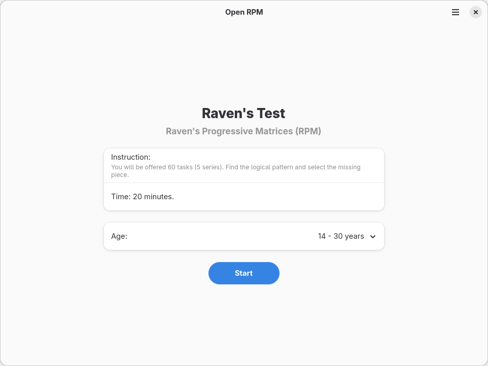
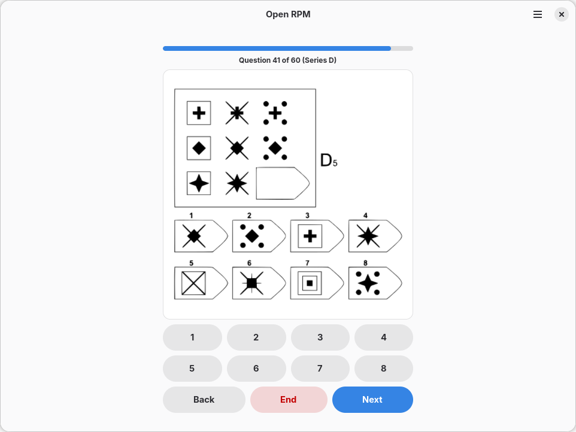
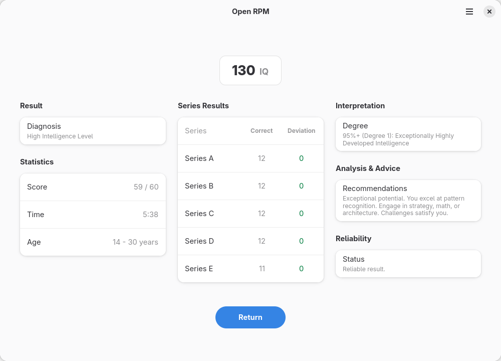

<p align="center">
  
</p>

# Open RPM

A modern, native implementation of Raven's Progressive Matrices (IQ Test) for GNOME.

[](https://www.gnu.org/licenses/gpl-3.0)
[](https://www.python.org/)
[](https://gtk.org/)
[](https://gnome.pages.gitlab.gnome.org/libadwaita/)

## Overview

**Open RPM** is a native GTK4/Libadwaita application designed to administer the standard Raven's Progressive Matrices test. Built with Python and following GNOME Human Interface Guidelines, it delivers a polished, responsive experience across desktop environments.

<p align="center">
  
</p>

The application features an adaptive scoring algorithm that adjusts IQ estimates based on the user's age group, along with robust support for multiple languages and automatic theme detection.

## Features

<p align="center">
  
</p>

- **Adaptive Scoring Engine**: Calculates IQ using a normative database and Catmull-Rom spline interpolation for precision.
- **Age-Adjusted Results**: Normalizes scores based on specific demographic data (ages 14 – 56+).
- **Multilingual Interface**: Full localization support for English, Russian, and Indonesian.
- **Privacy Focused**: Runs entirely offline. No data is transmitted to external servers.
- **GNOME Integration**: Native look and feel with automatic light/dark theme support.
- **Responsive UI**: Adaptive layout that scales gracefully across different screen sizes.

## Algorithm Details

The scoring system utilizes a pre-defined normative distribution. Raw scores are converted to a base IQ using Catmull-Rom spline interpolation. The final score is then adjusted by an age percentage factor to comply with standard psychometric practices.
<p align="center">
  
</p>

Reliability is calculated by comparing the user's performance in Series A (the easiest series) against expected deviations. Significant anomalies may flag the result as potentially unreliable due to misunderstanding or inattention.

## Installation

### Build from Source

```bash
git clone https://github.com/ikhlasulov-gb/open-rpm-gtk.git
cd open-rpm-gtk
flatpak-builder build build-aux/site.ikhlasulov.openrpm.json --user --install
```

## Documentation

The logic, normative data, and scoring standards of this test are strictly derived from the clinical manual:
- [Тест Равена. Шкала прогрессивных матриц.](Тест_Равена._Шкала_прогрессивных_матриц..pdf)

This document contains the detailed breakdown of the 5 series, correct answer keys, normative distributions, and IQ conversion tables used in this application.

## License

This project is licensed under the **GNU General Public License v3.0 or later**. See the [LICENSE](LICENSE) file for details.

## Contributing

Contributions are welcome.
